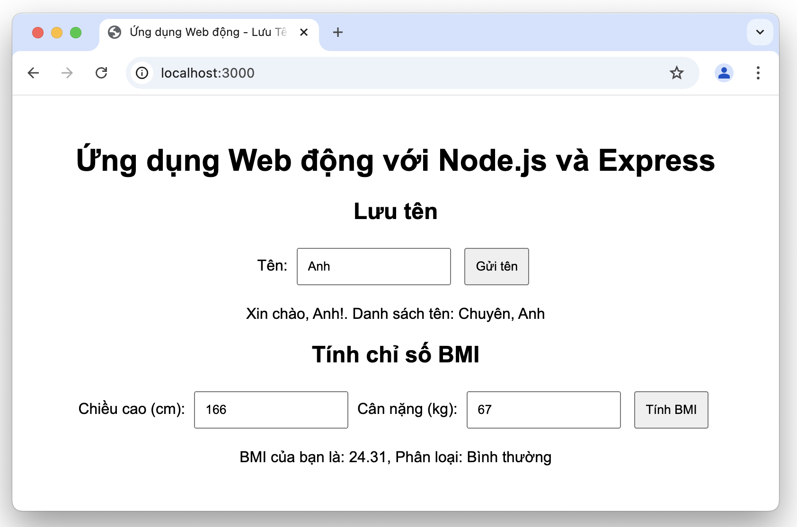

# Dynamic Web Lab

## Mục tiêu
- Hiểu và sử dụng các khái niệm cơ bản về ứng dụng web động.
- Tạo giao diện đơn giản bằng HTML, CSS, và JavaScript.
- Xây dựng server cơ bản với Node.js và Express.
- Kết hợp form với logic xử lý và phản hồi từ server.
- Nắm vững các khái niệm và kỹ năng cơ bản về kiểm thử tự động, bao gồm:
  - **Kiểm thử đơn vị**: Đảm bảo các phần nhỏ của mã nguồn hoạt động đúng như mong đợi.
  - **Kiểm thử tích hợp**: Xác minh khả năng tương tác giữa các thành phần trong hệ thống.
  - **Kiểm thử End-to-End (E2E)**: Đảm bảo chức năng ứng dụng hoạt động đầy đủ từ đầu đến cuối qua giao diện người dùng.

<figure>
  
  <center><figcaption>Giao diện mong đợi của ứng dụng</figcaption></center>
</figure>

## Điều kiện tiên quyết
- Visual Studio Code và Node.js
- Tham khảo video [https://youtu.be/6OsJwK1_Ajs](https://youtu.be/6OsJwK1_Ajs)

## Cấu trúc thư mục
Một cấu trúc thư mục tối ưu để dễ dàng mở rộng và bảo trì:
  ```text
  dynamic_web_lab/
  ├── .github/                    # Chứa các tệp cấu hình cho GitHub, đặc biệt là các workflow CI/CD.
  │   └── workflows/
  │       └── ci.yml              # Tệp cấu hình workflow cho GitHub Actions, dùng để tự động kiểm thử và triển khai.
  ├── .vscode/                    # Thư mục cấu hình cho Visual Studio Code, lưu các cài đặt cụ thể cho dự án.
  ├── src/                        # Thư mục chứa mã nguồn chính cho server backend.
  │   ├── app.js                  # Tệp khởi tạo và cấu hình ứng dụng Express, nơi server được khởi động.
  │   ├── routes/                 # Thư mục chứa các tệp định nghĩa các routes cho ứng dụng.
  │   │   └── api.js              # Tệp định nghĩa các routes, nơi thiết lập các đường dẫn cho các endpoint như `/api/v1/submit` và `/api/v1/bmi`.
  │   ├── controllers/            # Thư mục chứa các controller, nơi xử lý logic của các endpoint.
  │   │   └── nameController.js   # Controller để xử lý yêu cầu lưu tên, xác định logic phản hồi từ server.
  │   │   └── bmiController.js    # Controller xử lý yêu cầu tính chỉ số BMI và phân loại kết quả.
  │   └── models/                 # Thư mục chứa các mô hình (model) quản lý dữ liệu.
  │       └── names.js            # Model lưu và xử lý dữ liệu tên người dùng (có thể thêm phương thức lưu, lấy dữ liệu).
  │       └── bmi.js              # Model chứa logic tính toán BMI và phân loại (dựa trên chiều cao, cân nặng).
  ├── tests/                      # Thư mục chứa các tệp kiểm thử cho ứng dụng.
  │   └── app.test.js             # Unit test cho các endpoint, kiểm tra hoạt động của các API và logic backend.
  │   └── selenium_test.js        # Kiểm thử ứng dụng bằng Selenium cho giao diện người dùng, kiểm tra tương tác UI.
  ├── cypress                     # Thư mục cấu trúc cho kiểm thử End-to-End bằng Cypress.
  │   ├── e2e/
  │   │   └── ui_spec.cy.js       # Tệp kiểm thử UI với Cypress, dùng để kiểm tra luồng thao tác End-to-End.
  └── public/                     # Thư mục chứa tài nguyên tĩnh của frontend (HTML, CSS, JavaScript).
      ├── css/
      │   └── style.css           # Tệp CSS để định dạng giao diện của trang web.
      ├── js/
      │   └── script.js           # Tệp JavaScript xử lý logic phía frontend (sự kiện, gửi dữ liệu qua form).
      └── index.html              # Tệp HTML chính cho giao diện người dùng, hiển thị form và nhận dữ liệu.
  ├── .gitignore                  # Tệp cấu hình để loại trừ các tệp không cần theo dõi trong Git (node_modules, v.v.).
  ├── cypress.config.js           # Tệp cấu hình Cypress để thiết lập môi trường kiểm thử End-to-End.
  ├── package.json                # Tệp cấu hình chính cho dự án Node.js, chứa thông tin dự án và danh sách các thư viện phụ thuộc.
  ├── README.md                   # Tệp hướng dẫn chi tiết cách sử dụng và triển khai dự án.
  ```

## Các bước thực hiện
### Bước 1: Cài đặt Node.js và Express
1. Cài đặt Node.js
- Truy cập vào trang [node.js](https://nodejs.org), tải và cài đặt phiên bản LTS
- Kiểm tra cài đặt bằng cách sử dụng terminal và nhập lệnh
  ```bash
  node -v
  npm -v
  ```
Nếu hiện phiên bản mà không báo lỗi thì đã cài đặt thành công. Lúc này bạn có thể tiến hành các bước tiếp theo.

2. Khởi tạo dự án và cài đặt các thư viện cần thiết
  ```bash
  npm init -y
  npm install express
  npm install --save-dev jest supertest
  npm install --save-dev cypress
  npm install --save-dev wait-on
  npm install selenium-webdriver
  ```
- Sau khi cài đặt, chạy Cypress lần đầu:
  ```bash
  npx cypress open
  ```

3. Cấu hình `package.json` để thêm `jest` và các lệnh kiểm thử:
  ```json
  {
    "name": "dynamic_web_lab",
    "version": "1.0.0",
    "description": "Làm quen với ứng dụng web động",
    "main": "index.js",
    "scripts": {
      "prestart": "lsof -i :3000 | grep LISTEN | awk '{print $2}' | xargs kill -9 || true",
      "start": "node src/app.js",
      "test": "jest",
      "cypress:run": "npx wait-on http://localhost:3000 && cypress run",
      "test:e2e": "npm run start & npm run cypress:run"
    },
    "keywords": [],
    "author": "",
    "license": "ISC",
    "dependencies": {
      "chromedriver": "^130.0.2",
      "express": "^4.21.1",
      "selenium-webdriver": "^4.26.0"
    },
    "devDependencies": {
      "cypress": "^13.15.1",
      "jest": "^29.7.0",
      "supertest": "^7.0.0",
      "wait-on": "^8.0.1"
    }
  }
  ```

### Bước 2: Tạo server backend và frontend đơn giản
1. Tạo `server` với `Express`
- Tạo tệp `src/app.js` với nội dung:
  ```js
  const express = require('express');
  const path = require('path');

  const app = express();
  const port = 3000;

  app.use(express.urlencoded({ extended: true }));
  app.use(express.json());
  app.use(express.static(path.join(__dirname, '../public')));

  // Import routes
  const apiRoutes = require('./routes/api');
  app.use('/api/v1', apiRoutes);

  app.listen(port, () => {
      console.log(`Server đang chạy ở cổng ${port}`);
      console.log(`Truy cập vào http://localhost:${port} để xem ứng dụng`);
  });
  ```
2. Cấu hình các `route` và logic xử lý
- Tạo `src/routes/api.js` để định nghĩa các route:
  ```js
  const express = require('express');
  const router = express.Router();
  const { submitName } = require('../controllers/nameController');

  // Route cho endpoint /submit
  router.post('/submit', submitName);

  module.exports = router;
  ```
- Tạo `src/controllers/nameController.js` để xử lý logic cho route `/submit`:
  ```js
  const names = require('../models/names');

  const submitName = (req, res) => {
      const name = req.body.name;
      names.addName(name);
      res.json({ message: `Xin chào, ${name}!`, names: names.getNames() });
  };

  module.exports = { submitName };
  ```
- Tạo `src/models/names.js` để quản lý dữ liệu tên:
  ```js
  const names = [];

  const addName = (name) => {
      names.push(name);
  };

  const getNames = () => {
      return names;
  };

  module.exports = { addName, getNames };
  ```

3. Tạo giao diện `frontend` với HTML/CSS/JavaScript
- Tạo tệp `public/index.html`:
  ```html
  <!DOCTYPE html>
  <html lang="en">

  <head>
      <meta charset="UTF-8">
      <meta name="viewport" content="width=device-width, initial-scale=1.0">
      <title>Ứng dụng web động đơn giản</title>
      <link rel="stylesheet" href="css/style.css">
  </head>

  <body>
      <h1>Ứng dụng Web động với Node.js và Express</h1>

      <!-- Form Lưu Tên -->
      <section>
          <h2>Lưu tên</h2>
          <form id="nameForm">
              <label for="name">Tên:</label>
              <input type="text" id="name" name="name" required>
              <button type="submit">Gửi tên</button>
          </form>
          <p id="nameResponse"></p>
      </section>
      <!-- Form Tính BMI -->
      <section>

      </section>
      <script src="js/script.js"></script>
  </body>

  </html>
  ```
- Tạo tệp `public/css/style.css`:
  ```css
  body {
    font-family: Arial, sans-serif;
    text-align: center;
    margin: 50px;
  }
  form {
    margin-top: 20px;
  }
  input, button {
    padding: 10px;
    margin: 5px;
  }
  ```
- Tạo tệp `public/js/script.js`:
  ```js
  document.getElementById('nameForm').addEventListener('submit', async function (e) {
      // Ngăn hành vi mặc định của form (ngăn tải lại trang)
      e.preventDefault();

      // Lấy giá trị nhập từ trường input có id là 'name'
      const name = document.getElementById('name').value;

      // Gửi yêu cầu POST đến server tại route '/submit' với dữ liệu JSON
      const response = await fetch('/submit', {
          method: 'POST',  // Sử dụng phương thức POST để gửi dữ liệu
          headers: {
              'Content-Type': 'application/json',  // Định nghĩa kiểu nội dung gửi là JSON
          },
          body: JSON.stringify({ name: name }),  // Chuyển đổi đối tượng { name: name } thành chuỗi JSON
      });

      // Chờ phản hồi từ server và chuyển đổi phản hồi từ JSON thành đối tượng JavaScript
      const data = await response.json();

      // Hiển thị thông điệp trả về từ server trong phần tử có id là 'response'
      document.getElementById('nameResponse').textContent = data.message;
  });
  ```
### Bước 3: Kiểm thử với Jest và Supertest
- Tạo tệp `test/app.test.js`:
  ```js
  const request = require('supertest');
  const express = require('express');

  const app = express();
  app.use(express.json());

  // Import route và logic của bạn vào ứng dụng test
  const names = [];

  app.post('/api/v1/submit', (req, res) => {
      const name = req.body.name;
      names.push(name);
      res.json({ message: `Xin chào, ${name}!`, names });
  });

  describe('POST /api/v1/submit', () => {
      it('should return a greeting and update the names array', async () => {
          const res = await request(app)
              .post('/api/v1/submit')
              .send({ name: 'John' });
          expect(res.statusCode).toEqual(200);
          expect(res.body).toHaveProperty('message', 'Xin chào, John!');
          expect(res.body.names).toContain('John');
      });
  });
  ```
- Chạy kiểm thử:
  ```bash
  npm test
  ```
- Khởi chạy server bằng cách chạy lệnh
  ```bash
  npm start
  ```
- Truy cập vào http://localhost:3000 để xem ứng dụng

### Bước 4: Mở rộng ứng dụng
Nâng cấp mã của ứng dụng này để cho phép Tính chỉ số BMI trực tuyến.

#### Gợi ý cách thực hiện
1. **Frontend**: Bổ sung form Tính chỉ số BMI (cho phép nhập chiều cao, cân nặng) và gửi dữ liệu này đến server.
2. **Backend**: Tính toán chỉ số BMI dựa trên dữ liệu từ frontend, phân loại kết quả và gửi lại phản hồi là chỉ số BMI cùng với phân loại.
3. **Lưu ý**: Tham khảo cấu trúc thư mục và tệp tin cùng giao diện mong đợi của ứng dụng ở trên. Các tệp cần bổ sung và cập nhật bao gồm `public/index.html`, `public/js/script.js`, `src/controllers/bmiController.js`, `src/models/bmi.js`, `src/routes/api.js`
#### Chuẩn bị trước khi giao nộp
- Sau khi viết xong ứng dụng, hãy thực hiện kiểm tra bằng cách thực thi ứng dụng:
- Khởi chạy server bằng cách chạy lệnh
  ```bash
  npm start
  ```
- Truy cập vào http://localhost:3000 để xem ứng dụng, đảm bảo ứng dụng trông như mong đợi ở hình ảnh phía trên.
- Thực hiện kiểm thử đơn vị bằng Jest:
  ```bash
  npm test
  ```
- Thực hiện kiểm thử bằng Cypress:
  ```bash
  npm run start & npm run cypress:run
  ```
- Thực hiện kiểm thử bằng Selenium:
  ```bash
  node test/selenium_test.js
  ```
  
### Giao nộp
- Chạy thử ứng dụng: Đảm bảo rằng ứng dụng hiển thị đúng như mong muốn.
- Kiểm thử ứng dụng: Đảm bảo rằng ứng dụng hoàn thành các chức năng yêu cầu
- Commit và push thay đổi của bạn lên GitHub với message của bạn.
- Kiểm tra kết quả: Truy cập tab Actions trên GitHub của repository này.
GitHub Actions sẽ tự động kiểm tra mã của bạn. Nếu kiểm thử thành công, bạn sẽ thấy thông báo "Success".